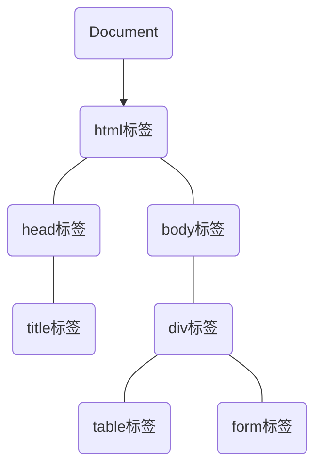

# JSBasic

JavaScript：描述网页的行为。

特点：脚本语言、动态的、弱类型、面向对象

JavaScript控制台（F12---Console）：直接输入JavaScript代码并运行出结果，一种简单实用的调试方式。

## JavaScript的组成

1. ECMAScript——JavaScript语法规范

2. DOM——Docment Object Model，文档对象模型

3. BOM——Browser Object Model，浏览器对象模型

   > DOM, BOM——WebAPI
   >
   > DOM：操作页面元素的API
   >
   > BOM：操作浏览器功能的API


JavaScript的位置：

1. HTML标记标签内，或者说是行内

   ```html
   <input type="button" value="confirm" onclick="alert('Hello, world.')" />
   ```

   

2. `<script>`标签内

   ```html
   <script>
       	alert("Hello, world!");
   </script>
   ```
   
   

3. 外部JavaScript文件引入——该`<script>`标签中不可再写任何JS代码

   ```html
   <script src="file.js"></script>
   ```

   通常放置位置：`<body>`标签的最后。


## 变量

注意：***JS中变量声明时并不声明变量的数据类型。***

是一个容器，里面存储了被操作的数据，根据变量名获取到这个”容器“内的数据。Container

* 变量的声明 ---- `var`，`let` ，`const` (后两者ES6，局部变量)
* 变量的声明及初始化赋值 ---- 变量声明了，但未赋初始值，则这个变量的值是undefined。
* 多个变量的声明赋值 ---- 逗号隔开各个变量

变量名的命名规则

* 除了以字母、下划线开头，**$也包括**。
* 驼峰命名法：`var bigNumber=10;`
* 大小写敏感 ---- case-sensitive


## 数据类型

2类数据类型：原始类型(primitive type)、对象类型(object type)。总共7种

### 原始类型

1. Number

2. String
   通过`.length`获取字符串的长度

   ```html
   <script>
   	var str="abc";
       console.log(str.length);
   </script>
   ```

   通过`+`拼接字符串

   * 只要有一个是字符串，则为字符串拼接功能
   * 只有都是数字，才进行加的算术运算

   ```html
   <script>
       console.log("a"+"b"+"c");
   </script>
   ```

3. Boolean

4. Symbol(primitive data type)

#### 2个特殊的原始值

通常分别代表了各自特殊类型的唯一的成员

1. Null
2. Undefined


### 对象类型

对象：属性(property)的集合，每个属性都由”名/值对“构成。

* ”名/值对“中的值可以是：原始值、函数、对象。
* 特殊的对象：全局对象。


`NaN` : not a number，与任何值都不等，包括他本身。通过`isNaN()`验证其他值是不是、不是一个数值，多数验证用户的输入的数据是否是正确的格式。

```javascript
var x = prompt("Please enter a star number for service");
if(isNaN(x)){
   alert("Please enter right number, not other data.");
} else {
    alert("Thanks for you vote.")
}
```

获取数据类型——`typeof()`

转义字符(escape)——`\`

字面量，直接量，固定值：程序中直接使用的数据值。


### 数据类型转换

1. 转换成Number
   * `parseInt()`
   * `parseFloat()`
   * `Number()`——严格地
     如果要转换的字符串中有任一非数值字符，则返回NaN
2. 转换成String
   * `toString()`——更常用的
   * `String()`——更保险的
     可适用于undefined, null
3. 转换成Boolean
   * `Boolean()`
     `0`、`''`、`null`、`undefined`、`NaN`、`false`转换后的值均为：false，其他true，比如：`[]`、`{}`。

### 【隐式类型转换】

参考链接：[Javascript 隐式类型转换，一篇就够了！](https://chinese.freecodecamp.org/news/javascript-implicit-type-conversion/)

#### 数学运算符中的类型转换

>  ***因为JS中并没有类型声明，这意味着任意2个变量或字面量，都可以做加减乘除——弱类型的体现***

##### 1. 减、乘、除

对各种**非`Number`类型**的进行减、乘、除时，**先将其转换成`Number`类型**

```javascript
1 - true //先将true转换成数字1，然后1 - 1，即结果为0
1 - null //先将null转换成数字0，然后1 - 0，即结果为1
1*undefined //将undefined转换成数字是NaN，然后1*NaN，即结果为NaN
2*['5'] //先将['5']拆箱得到'5'，然后'5'转换成数字5，所以2*5，结果为10
```

| 实数 | undefined | NaN  | null            | ture   | false           |
| ---- | --------- | ---- | --------------- | ------ | --------------- |
| 减   | NaN       | NaN  | 实数-0=实数     | 实数-1 | 实数-0          |
| 乘   | NaN       | NaN  | 实数*0=0        | 实数*1 | 实数*0          |
| 除   | NaN       | NaN  | 实数/0=Infinity | 实数/1 | 实数/0=Infinity |

```javascript
NaN*NaN //NaN
undefined*undefined //NaN
undefined*NaN //NaN
undefined/null //NaN
null-true //-1, 
false+true //1
true+true //2
false-null //0
```


##### 2. 特殊的加法

以下3种规则，优先级由高到低：

* 当一侧为`String`类型，则被识作字符串拼接，即将另一侧的转换成字符串类型。
* 当一侧为`Number`类型，另一侧为原始类型(`null`、`undefined`)，则将原始类型转换成`Number`类型。
* 当一侧为`Number`类型，另一侧为引用类型(`[]`、`{}`)，则将引用类型和`Number`类型转换成字符串后拼接。

```javascript
123+'123' //字符串'123123'，规则1
123+null //规则2，将null转换成数字0，即123+0，结果为数值123
123+true //规则2，将true转换成数字1，即123+1，结果为数值124
123+{} //规则3，将{}转换成字符串'[object Object]'，将123转换成'123'，拼接起来，得到的结果为字符串：123[object Object]
```


#### 逻辑语句中的类型转换

当使用`if`、`while`、`for`语句时，条件表达式的值为布尔值，即`Boolean`。

##### 1. 单个变量

如果只有单个变量，则先将变量转换成布尔值

Tips：只有`0`、`''`、`null`、`undefined`、`NaN`、`false`转换后的值均为：false，其他true，比如：`[]`、`{}`。

##### 2. 使用==比较的5条规则

根据`==`两侧的数据类型，总结的5条规则：

* 规则1：`NaN`和其他任何数据类型比较，永远返回的是false（包括他自己本身）。

* 规则2：`Boolean`和其他任何数据类型比较时，`Boolean`首先被转换成`Number`类型。

* 规则3：`String`和`Number`比较，先将`String`类型转换成`Number`类型。

* 规则4：`null`==`undefined`比较结果是`true`，除此之外，`null`、`undefined`和其他任何数据类型比较的值都为`false`。

* 规则5：**原始类型**和**引用类型**做比较时，引用类型会依照`ToPrimitive`规则转换成原始类型。

  > `ToPrimitvie`规则：引用类型--->原始类型
  >
  > * 遵循先`valueOf`后`toString()`的模式，得到一个原始类型

  如果无法得到一个原始类型，则抛出`TypeError`。

#### 类型转换表

| 数据类型   | 值             | toBoolean | toNumber       | toString                |
| ---------- | -------------- | --------- | -------------- | ----------------------- |
| Boolean    | true           | true      | 1              | "true"                  |
| Boolean    | false          | false     | 0              | "false"                 |
| Number     | 123            | true      | 123            | "123"                   |
| Number     | Infinity       | true      | ***Infinity*** | "Infinity"              |
| Number     | 0              | false     | 0              | "0"                     |
| **Number** | ***NaN***      | false     | NaN            | "NaN"                   |
| String     | ""             | false     | ***0***        | ""                      |
| String     | "123"          | true      | 123            | "123"                   |
| String     | "123xyz"       | true      | NaN            | "123xyz"                |
| String     | "abc"          | true      | NaN            | "abc"                   |
| **Object** | ***null***     | false     | ***0***        | "null"                  |
| Undefined  | undefined      | false     | NaN            | "undefined"             |
| Function   | function(){}   | true      | NaN            | "function(){}"          |
| Object     | {}             | true      | NaN            | ***"[object Object]"*** |
| Array      | ["abc"]        | true      | NaN            | "abc"                   |
| Array      | ["123"]        | true      | 123(拆箱)      | "123"                   |
| Array      | ["123", "abc"] | true      | NaN            | "123abc"                |


## 操作符、操作数、表达式

* 操作符、运算符——operator

  > > 1. 算术运算符
  > >
  > > * 一元运算符
  > >   * ++, --
  > > * 二元运算符
  > >   * +, -, *, /, % 
  > > * 三元运算符
  >
  > > 2. 逻辑运算符
  > >
  > > * 逻辑与 `&&`
  > >
  > > * 逻辑或`||`
  > >
  > > * 逻辑非`!`
  > >
  > >   > 短路运算
  > >   >
  > >   > 
  >
  > > 3. 关系运算符（比较运算符）
  > >
  > > * \>, \>=, <, <=, ==, !=F
  > > * ===, !==：包括值、类型的比较
  >
  > > 4. 赋值运算符
  > >
  > > * =, +=, -=, *=, /=, %=
  >
  > 运算符的优先级

* 操作数——operation

* 表达式：由操作数、操作符组成的式子，会有值。


## Objcts

JavaScript variable are **containers** for data values. 

**Objects are variables too**, they can contain many values.

无序属性的集合。

 Think of an object as a list of  values: **name: value** pairs --- 名值对。

`name : value` 是对象的属性及属性值。其中，value也可以是函数。

JavaScript objects are containers for **named values**.

|     name      |         value         |
| :-----------: | :-------------------: |
| Property 属性 | Property Value 属性值 |
|     name      |      John Smith       |
|      sex      |         male          |
|      age      |          25           |
|    height     |          180          |


```
对象的行为和特征：
特征 ---- 属性 属性一般是名词，描述事物的特征
行为 ---- 方法 方法一般是函数，描述对事物的行为和功能
```


### The Object Constructor

对象构造器

***The Standard way to create an "object type" is to use an object constructor function.***

```javascript
function cat(name, age, color){
    this.name = name;
    this.age = age;
    this.color = color;
}
//function (cat) is an object constructor, which takes parameters and assigns them to the object properties.
```

The **this** keyword refers to the **current object** , and **its value cannot be changed**.


##### 创建对象的三种方式

在JavaScript中，对象是由new运算符生成的，生成对象的函数被称为类（或称构造函数、对象类型）。

生成的对象 ---- 类的实例，简称为对象。

1. **调用系统的构造函数** 

   ```javascript
   //var 变量名 = new Object(); Object是系统的构造函数
   //实例化对象
   var obj = new Object();
   //对象有特征：属性和行为————方法
   
   //添加属性————对象名.对象属性名 = 对象该属性名的属性值 ————name: value 名值对
   obj.name = "The Doctor";
   obj.age = 1000000;
   obj.sex = "other";
   
   //添加方法————对象.属性名 = 函数
   obj.escape = function (){
       alert("LISTEN");
   };
   
   //获取指定对象的某个属性的属性值
   alert("My name is "+obj.name);
   
   //调用指定对象某个属性的行为？
   //调用指定对象的指定方法
   obj.escape();
   ```

   

   ***new keyword is used for creating an instance of an object.***

   

2. **自定义构造函数**（工厂模式）
   构造函数，一种特殊的函数。主要用来在创建对象时初始化对象，即w

   ```javascript
   //自定义构造函数的函数名通常大写开头
   function Phone(brand, price, capacity, height, width, depth, weight, display){
       this.brand = brand;
       this.price = price;
       this.capacity = capacity;
       this.height = height;
       this.width = width;
       this.depth = depth;
       this.weight = weight;
       this.display = display;
       this.sendMsg = function () {
           console.log("Hello, iPhone SE.")
       }
   }
   
   //实例函数，即创建一个对象，实例化对象
   //let objectName = new 自定义构造函数名(参数)
   let phone = new Phone("Apple", 2999, 64, 138.4, 67.3, 7.3, 148, 4.7)
   
   //添加一个属性，并赋予属性值
   phone.chip="A13 Bionic Chip";
   
   //调用对象的方法
   //对象名.方法名();
   //对象名['方法名']();
   phone.sendMsg();
//or phone["sendMsg"]();
   
   ```
```
   
this关键字 ---- 隐式对象
   
   
   
3. **字面量的方式** ---- the object literal( or initializer) syntax

   This allows you to create only **a  single object**.

   ```javascript
   let obj = {}; //一个空对象
   
   let dog = {
       name: "cookie",
       age: 5,
       color: brown,
       size: big
   }
```


### Access properties 

获取属性的两种方式：

* 通过. 、[""]

```javascript
//Access the object's properties by using the dot syntax.
objectName.propertyName
//or 当使用[]访问对象的属性时，则可以使用字符串下标来表示属性，即下标字符串是对象的属性名
objectName['propertyName']

//if property value is a function,该属性被称为该对象的方法，使用小括号访问该方法
objectName.propertyName();
//or
objectName["propertyName"]();

//if property value is an object,可以设计嵌套对象，通过连续的点运算符.来访问内部对象

```

```javascript
var person = {
    name: "John Smith", //注意：尾部逗号分隔
    sex: "male",
    age: 25,
    height: 180, //注意：最后一个属性的尾部不必写逗号
    run:function (){
        alert("Every Wednesday!");
    }
}; //别忘记这里的分号

//objectName.propertyName;
var x = person.name;
//objectName['propertyName']
var y = person['age'];

var z = person['run']();
//or var z = person["run"]();


//注意：alert() function只接收一个参数，所以下面后面的Age不能输出
alert("Name: "+x,"Age: "+y);

//正确形式
alert("Name: "+x);
alert("Age: "+y);
```

JavaScript's built-in **length** ***property*** is used to count the number of characters in a property or string.

```javascript
//输出指定属性的属性值字符串长度，即该具体字符串里字符的个数
//count the number of characters in an object's property
alert(person.sex.length);
```


### Object Methods

An object **method** is a **property** that contains a **function definition**.

> 一个对象的方法是一个属性，这个属性里包含了一个函数定义。

***Methods are functions that are stored as object properties.***

> method是一个funciton，这个function以对象的属性作为存储。
>
> method是将对象属性作为存储的function。

#### Create an object method

```javascript
//create an object method
methodName = function(){
    code lines
}
```

#### Access an object method

```javascript	
objectName.methodName();
```

eg.

```javascript
//output data
document.write("This is some text.");
//The write() function is actually a method of the document object.
```

A method is a function, belonging to an object. It can be referenced using  the this keyword.

Defining methods is done inside the constructor function.

The "this" keyword in the method means: the current object.

An object's properties are similar to variables; methods are similar to functions.


#### 遍历对象

`for in` ---- 遍历对象的属性名

```javascript
let obj = {
    name: "john",
    age: 25,
    sex: "male",
    job: "artist",
    hobby: "cooking",
    favFood: "ice-cream",
};

for(let k in obj){
    console.log(k); //输出的是对象的每个属性，properties
    console.log(obj[k]); //输出的是对象的每个属性对应的属性值，propertyValues
}
```


删除对象的属性 ---- delete objectName.propertyName

#### 简单类型和复杂类型

简单类型，基本类型，值类型：number, string, boolean, symbol

复杂类型，引用类型：object

空类型：null, undefined

值类型之间，传递值。

引用类型之间，传递引用。

堆：存储复杂类型， 

* 垃圾回收机制

栈：存储函数的参数值、局部变量的值等

JavaScript的基本类型在栈中存储，object存储在堆中。


### 内置对象

#### Math对象

The Math object allows you to perform mathematical tasks, and include several properties.

**Math has no constructor**, there is no need to create a Math object first.

常用的Math属性与方法

```javascript
Math.PI; 
Math.abs();
Math.max();
Math.min();
Math.ceil(); //向上取整
Math.floor(); //向下取整
Math.pow(x, y); //x的y指数次幂
Math.random(); //[0, 1)之间的伪随机数
Math.round(x); //四舍五入
Math.sqrt(x); //平方根

Math.random(-1.5); //-1，而不是-2，因为往大取
```


#### Date对象

A date consists of a year, a month, a day, an hour, a minute, a second, and milliseconds.

Date objects are static, rather than dynamic. The computer time is ticking, but date objects don't change, once created.

默认获取当前系统的时间。通过创建`Date` 实例来处理日期和时间。

##### Create a Date Object

```javascript
//Using new Date(), create a new date object with the current date and time
var dt = new Date();

//or, the other way to initialize dates allow for the creation of new date object from the specified date and time. ---- 指定日期时间
new Date(milliseconds);
new Date(dataString);
new Date(year, month, day, hours, minutes, seconds, milliseconds)

* console.log(dt.toString());

console.log(dt.toDateString()); //EN ---日期
console.log(dt.toLocalDateString()); //数字日期

console.log(dt.toTimeString());
console.log(dt.toLocalTimeString()); //小时分钟秒

* console.log(dt.valueOf()); //1970.01.01到当前的毫秒值 ----获取日期的毫秒值

var now = + new Date(); //Date对象的一种特殊的写法，只适用于Date对象。不支持的H5的浏览器通过此种获取valueOf()
```


##### Date Methods

> * Date.getDay(); //一周的第几天，0表示星期日
> * Date.getDate(); //一月中的哪一日
> * Date.getFullYear(); //年份
> * Date.getMonth(); //月份，0表示1月
> * Date.getHours(); //小时数
> * Date.getMinutes(); //分钟数
> * Date.getSeconds(); //秒数
> * Date.getTime(); //格林威治时间


#### Array对象(Core Objects)

对象(Object)是无序数据的集合 ---- 无序

数组(Array)是有序数据的集合 ---- 有序

对象、数组可以相互转换。

Arrays store multiple values in a single variable.  //注意这里的Array表示Array对象

An array is **a special type of object**.

An array uses **numbers** to access its elements, and an object uses **names** to access its members.

##### Create an Array

```javascript
//1、关键字new
//通过new和构造函数Array()创建一个Array实例对象
var arr = new Array("HTML", "CSS", "JavaScript", "Python");

//or, you can also declare an array, tell it the number of elements it will store, and add the elements later.
let arr2 = new Array(3); //这里的参数3，指定的是数组的长度，即数组的元素有多少个
arr2[0] = "C";
arr2[1] = "Perl";
arr2[2] = "PHP";

//or, JavaScript arrays are dynamic, so you can declare an array and not pass any arguments with the Array() constructor. You can add the elements dynamically(add as many as you need to).
var arr3 = new Array();
arr3[0] = "Visual Bacic";
arr3[1] = "C#";
arr3[2] = "Ojective-C";
arr3[3] = "R";

//2、字面量 ---- Array Literal 推荐的方式？
//For greater simplicity, readability, and excution speed, you can do this way.
var arr4 = ["SQL", "Go", "Ruby"];
```

##### Accessing an Array

You refer to an array element by referring to the **index number** written in square brackets.

```javascript
var course = arr[0]; //"HTML"
arr[3] = "Java"; 
console.log(arr); //原来的数组中某个值被改变了

//如果尝试访问超过该数组的索引号，则返回的是undefined
console.log(arr[9]);
```

##### Array Properties &Methods

* The length Property: it returns the number of its elements. ---- 最最常用的

  > ​	An array has the "length" property , it means that an array is an object.

* Combining Arrays: JavaScript's concat() method allows you to join arrays and create an entirely new array. 组合数组

  ```javascript
  var c1 = ["HTML", "CSS"];
  var c2 = ["JavaScript"];
  var c3 = c1.concat(c2); 
  var c4 = c2.concat(c1);
  console.log(c3);
  console.log(c4); //两个数组的元素排列方式并不相同
  ```


在去重方法中，为什么调用对象的属性时用的是中括号，而不是点方法？

因为：

1、中括号法可以用变量作为属性名,而点方法不可以；

2、中括号法可以用数字作为属性名,而点语法不可以；

3、中括号法可以使用JS的关键字和保留字作为属性名,而点语法不可以(尽量避免在变量或者属性中使用关键字或保留字)。


##### Associative(关联、联合) Arrays

虽然其他的编程语言里支持arrays with named indexes(**text instead of number**)，即所谓的关联数组，但在JS中并不支持。(In JS, arrays always use numbered indexes.)

但，you still can use the named array syntax, which will produce an object. 

尤其注意这是一个object！而不再作为一个数组。那么标准的数组属性与方法将产生错误的值，比如`person.length`的返回值是0。

```javascript
var person = []; //空数组
person["name"] = "John";
person["age"] = 45;
person["height"] = 180;
console.log(person["name"]);
console.log(person.height);

console.log(person.length);
```

It is better to use an object when you want the index to be a string(text).

Use an array when you want the index to be a number.

If you use a named index, JS will redefine the array to a standard object.


#### :star:数组对象方法

* 使用`delete` 删除数组元素，其数组的长度不改变，即数组的length属性值不变。

  > 当改变数组的长度时，即给数组的length属性重新赋值时，数组会自动地在末尾增加或删除元素，增加的元素其值为undefined。

* 使用`push()` 和`pop()` 方法操作数组 ---- 尾部，原数组长度被改变，即原数组被改变

  > * `push(item...)` ---- 在数组的末尾，插入一个或多个元素。多个参数。返回值：新数组的长度。
  >
  >   ```javascript
  >   let arr = new Array(1, 2, 3, 4)
  >   arr.push(5, 6, 7); //并返回操作后数组的长度
  >   //which means,
  >   console.log(arr.push(9)); //返回的是8
  >   
  >   //改变原数组
  >   console.log(arr); //[1, 2 ,3, 4, 5, 6]
  >   //如果push()不传值，那么默认返回数组的长度
  >   console.log(arr.push());
  >   ```
  >
  >   
  >
  > * `pop()` ---- 从数组的末尾，依次将元素删除，或者说**提取元素**。无参数。返回值：被删除(提取)的元素。
  >
  >   ```javascript
  >   var arr = new Array('a', 'b', 'c', 10);
  >   arr.pop();
  >   console.log(arr); //['a', 'b', 'c']
  >   ```

* 使用`unshift()` 和`shift()` 方法操作数组 ---- 头部，原数组长度被改变，即原数组被改变

  > * `unshift()` 在数组的头部，增加元素，返回值是新数组的长度。
  >
  > * `shift()` 从数组的头部，删除(**提取**)第一个元素，无参数，返回值是被删除(提取)的元素。
  >
  >   ```javascript
  >   var arr = new Array(1,2,4);
  >   arr.unshift(0); //并返回操作后数组的长度
  >   
  >   console.log(arr);
  >   
  >   arr.unshift(-2,-3);
  >   console.log(arr); //[-2, -3, 0, 1, 2, 4] 不是[-3, -2, 0, 1, 2, 4]
  >   
  >   arr.shift();
  >   console.log(arr);
  >   arr.shift(3); //仍旧按arr.shift()来执行，直接忽略了传入的3
  >   console.log(arr);
  >   ```

* :star:使用`splice(开始的位置, 删除的个数, 额外添加的元素)` 方法 ---- 在数组指定位置**删除**、**插入(添加)**元素的方法。

  > 3个参数
  >
  > * startIndex：指定插入的起始位置，start from 0
  > * deleteCount：指定删除元素的个数
  > * item：要插入(添加)的具体元素
  >
  > 改变原数组，返回值是：被删除的元素组成的数组。
  >
  > ```javascript
  > let a = new Array(1, 2, 3, 4, 5, 6, 7);
  > //传入2个参数
  > let b = a.splice(2, 3); //从0开始索引
  > document.write(a+"<br />"); //[1, 2, 6, 7]
  > document.write(b+"<br />"); //[3, 4, 5]
  > 
  > //传入3个参数
  > //第一个参数是指定从什么位置开始，第二个参数是删除多少个元素，剩余的参数是要添加的元素
  > let c = a.splice(1, 2, -2, -4, 9, 19); 
  > document.write(a+"<br />"); //[1, -2, -4, 9, 19, 7]
  > document.write(c+"<br />"); //[2, 6]
  > ```

* `join()` ---- 数组转多种形式的字符串的方法，一个参数，该参数用来定义合并元素的连字符，默认逗号。

  > ```javascript
  > 
  > 
  > let arr = ['h', 'e', 'l', 'l', 'o']
  > 
  > let str = arr.join(); //如果参数为空，那生成的字符串默认以逗号分隔
  > console.log(str); //"h,e,l,l,o"
  > 
  > let str = arr.join(''); //空字符串，返回的是无间隔的、连续的字符串
  > console.log(str) //'hello'
  > 
  > let str = arr.join(' '); //一个空格字符串，生成的字符串的每个字符以空格分隔
  > console.log(str); //'h e l l o'
  > ```

  

* `reverse()`

  

* `sort()`

  

  

* `toString()`


#### :star:字符串对象方法

* `split()` ---- 将**字符串**分割为一个数组，2个参数，第一个参数指定分隔符，第二个参数指定返回数组的长度。


## The DOM

为了实现(完成)加载一个网页的HMTL，the browser builds the **Document Object Model** of that page, which is an object oriented(以...为目标，导向) model of its logical structure.

The DOM of HTML document can be represented as a nested set of boxes.

DOM Tree: HTML elements --- **nodes** --- Nodes can have **child** nodes, if on the same level are called **siblings**.



用来描述JavaScript脚本怎样与HTML或XML文档交互的Web标准。

* 使用JS操作节点
* 使用JS操作文档
* 使用JS操作元素
* 使用JS操作文本和属性


DOM1级定义了Node接口，该接口为DOM的所有节点类型定义了原始类型。

### 传统、获取元素的方式

> `document` 是主要的入口
>
> ```javascript
> // 1. 通过id名获取该元素
> // 返回值是：仅一个元素对象
> document.getElementById('id名')
> 
> // 2. 通过标签名获取某类标签元素
> // 返回值是：元素对象的集合 ---- 伪数组
> document.getElementsByTagName('标签名')
> 父元素.getElementsByTagName('标签名')
> 
> ```
>
> 

### H5、获取元素的方式

> 
>
> ```javascript
> // 1. 通过类名获取元素
> document.getElementsByClassName('类名')
> 
> // 选择器
> // 根据指定的选择器，返回第一个匹配到的元素对象，即返回的仅有一个元素对象
> document.querySelector('选择器')
> 
> // 1. 获取到的是第一个匹配到类名的元素
> document.querySelector('.类名')
> 
> // 2. 获取到的是第一个匹配到id名的元素
> document.querySelector('#id名')
> 
> // 3. 获取到的是匹配到类名的所有元素，即返回的对象有多个
> document.querySelectorAll('')
> ```

### 获取`body` 元素、`html` 元素

```javascript
//获取body元素对象
document.body

//获取html元素对象
document.documentElement
```


### 事件三要素

触发 ---- 响应机制

事件三要素：事件源、事件类型、事件处理程序

> * 事件源：事件被触发的对象，比如button
>
> * 事件类型：如何触发，什么事件，比如鼠标经过、悬停、点击(onclick)、scroll
>
> * 事件处理程序：通过一个函数赋值的方式完成
>
>   ```
>   1. 获取元素
>   2. 绑定事件
>   3. 事件处理程序
>   ```

#### 常见的鼠标事件

| 鼠标事件(8) |   触发条件   |
| :---------: | :----------: |
|   onclick   |     点击     |
| onmouseover |   鼠标经过   |
| onmouseout  |   鼠标离开   |
|   onfocus   | 获得鼠标焦点 |
|   onblur    | 鼠标失去焦点 |
| onmousemove |   鼠标移动   |
|  onmouseup  |   鼠标弹起   |
| onmousedown |   鼠标按下   |


### 操作元素

#### 1. 修改元素的内容

> 1. 通过`innerText` 修改元素的内容
>
>    ```javascript
>    // 从起始位置到终止位置的内容，(不识别HTML标签)去除HTML标签、空格、换行，非标准
>    element.innerText
>    ```
>
> 2. 通过`innerHTML` 修改元素的内容 :star:
>
>    ```javascript
>    // 从起始位置到终止位置的全部内容，(识别HTML标签)保留HTML标签、空格、换行，W3C推荐，标准
>    element.innerHTML
>    ```

#### 2. 修改元素的属性的属性值

通过重新赋值的方式

> 1. 获取属性：元素对象.属性名
>
> 2. 设置属性的值：元素对象.属性名 = 属性值
>
>    例如：src, href; id, alt, title

#### 3. 操作表单元素

> 利用DOM操作如下表单元素的属性：
>
> ```
> type, value, checked, selected, disabled(表单禁用)
> 
> //其中，checked, selected, diabled的属性值是布尔值，即true or false
> ```
>
> 案例：密码框的查看与隐藏

#### 4. 操作样式属性

> Style ---- 样式，改变元素的样式
>
> ```javascript
> // 1.改变行内样式 ---- element.style
> element.style.样式属性 = 值;
> 
> //注意，有些赋的值要注意单位，或者是否以字符串形式
> div.style.backgroundColor = 'orange'; //字符串形式的值
> div.style.width = '300px'; //别忘记单位px
> 
> 
> // 2. 改变类名样式 ---- element.className
> // 如果样式要修改的较多，则通过操作类名方式更改元素样式
> // className会直接更改元素的类名，覆盖原先的类名，
> // 那么，如果想保留原有的类，则通常的做法是：element.className = '原类名选择器名 新类名选择器名';
> element.className = 值;
> element.className = '类名';
> 
> ```

#### 5. 排他操作 :star:

> 如果有同一元素，然后要给其中的某一个元素实现某种样式，这里用到的是循环的排他思想
>
> 1. 所有元素遍历清除样式
> 2. 给当前元素添加样式
>
> 案例：切换背景图、表格隔行变色、全选反选。

#### 6. 自定义属性操作 :star:

> * 获取属性值的两种方式：
>
>   1. `element.propertyName` 
>
>   2. `element.getAttribute('propertyName')`
>
>      区别：
>
>      * 前者，获取的是元素的内置属性，即元素本身自带的属性
>      * 后者，获取的是自定义属性，元素的属性可以自定义，比如添加一个'index'的属性
>
> * 设置属性值的两种方式：
>
>   1. `element.propertyName = 'value'` (设置内置属性)
>
>      ```javascript
>      div.className = 'navs';
>      ```
>
>      
>
>   2. `element.setAttribute('propertyName', 'value')` (设置自定义属性，推荐)
>
>      ```javascript
>      div.setAttribute('class', 'footer');
>      ```
>
> * 移除属性，删除属性：
>
>   1. `removeAttribute('属性')`
>
>      ```javascript
>      div.removeAttribute('index');
>      ```
>
> 案例：根据tab栏的切换，显示不同的内容。

#### 7. H5自定义属性

> 自定义属性的目的：为了保存并使用数据。有些数据可以保存到页面中，而不用保存到数据库中。
>
> H5规定自定义属性，以 `data` 开头，作为属性名且赋值。
>
> 1. 设置H5自定义属性
>
>    ```html
>    // 形如，其中的data-index就是H5形式的自定义属性，后者index是自定义属性的属性名
>    <div data-index = "0"> </div>
>    ```
>
>    ```javascript
>    element.setAttribute('data-index', 1);
>    ```
>
> 2. 获取H5自定义属性
>
>    ```javascript
>    //兼容性获取自定义属性的属性值
>    element.getAttribute('data-属性(名)')
>    
>    //H5新增，IE 11以上，index指代自定义属性(名)
>    element.dataset.index
>    //or
>    element.dataset['index']
>    
>    ```


### 节点操作

> 节点，node。DOM树中的所有节点都可以通过JavaScript来增、删、改、查。
>
> **节点的三个属性**：
>
> > * **nodeType(节点类型)**
> >   * **元素节点**，值为1(实际开发中，常操作的节点是元素节点)
> >   * 属性节点，值为2
> >   * 文本节点，值为3(文本节点包括空格、换行)
> > * **nodeName(节点名称)**
> > * **nodeValue(节点的值)**
>
> 节点层级：父子关系、兄弟关系(**父子兄层级关系**)
>
> > **父子**
> >
> > > **父级节点** :star:
> > >
> > > ```javascript
> > > // 返回的是最近的一个父节点
> > > // 如果找不到指定节点的父节点，则返回null
> > > node.parentNode
> > > ```
> > >
> > > **子节点**
> > >
> > > 所有的子节点：
> > >
> > > ```javascript
> > > // 返回的是指定节点下的所有子节点的集合，且该集合是实时更新的集合 标准
> > > // 所有的子节点集合包括文本节点(文本内容、空格、换行)、元素节点...
> > > // 因为获取不到指定的子元素节点，所以通常比较少使用
> > > parentNode.childNodes
> > > ```
> > >
> > > **子元素节点**：:star:
> > >
> > > ```javascript
> > > // 非标准，但实用，实际开发中常用的
> > > // parentNode.children是一个只读属性，只返回指定元素节点下的所有子元素节点，不包括属性节点、文本节点
> > > parentNode.children
> > > ```
> > >
> > > **第1个子节点**：`parentNode.firstChild`
> > >
> > > **第2个子节点**：`parentNode.lastChild`
> > >
> > > **第1个子元素节点**：`parentNode.firstElementChild`  (IE9以上)
> > >
> > > **最后1个子元素节点**：`parentNode.lastElementChild`  (IE9以上)
> > >
> > > ```
> > > 因为兼容性问题，那么实际开发中如何获取第1个或最后1个子元素节点？
> > > 1. 获取第1个子元素节点
> > > parentNode.children[0]
> > > 2. 获取最后1个子元素节点
> > > parentNode.children[parentNode.children.length - 1]
> > > ```
> > >
> > > 案例：新浪移动显示隐藏下拉菜单效果
> >
> > **兄弟**
> >
> > > **上一个兄弟节点** ：`node.previousSibling`
> > >
> > > **下一个兄弟节点** ：`node.nextSibling`
> > >
> > > **上一个兄弟元素节点** ：`node.previousElementSibling`  (IE9以上)
> > >
> > > **下一个兄弟元素节点** ：`node.nextElementSibling`  (IE9以上)
> > >
> > > 封装兼容性函数：
> > >
> > > ```javascript
> > > function getNextElementSibling(element){
> > >     let el = element;
> > >     while( el = el.nextSibling ){
> > >         if( el.nexSibling === 1 ){
> > >             return el;
> > >         }
> > >     }
> > >     return null;
> > > }
> > > ```
> >
> > **创建节点** ：`document.createElemnt('tagName')` ---- 动态创建元素节点
> >
> > // 创建后的节点，要添加到指定节点处，才能在网页中显示。
> >
> > **添加节点** 
> >
> > > * `node.appendChild(child)` ---- 将一个节点添加到指定父节点的子节点列表的末尾
> > > * `node.insertBefore(child， 指定元素)` ---- 将一个节点添加到指定父节点的子节点列表的头部
> >
> > ```html
> > <body>
> > 	<ul>
> >         <li>0</li>
> >     </ul>
> >     
> >     <script>
> >     	// 1. 获取要操作的元素节点
> >         let ul = document.querySelector('ul');
> >          // 创建节点
> >         let moreLi = document.createElement('li');
> >         // 添加到指定节点处
> >         // 从ul的尾部追加元素节点
> >         ul.appendChild(moreLi);
> >         console.log(ul);
> >         // 从ul中的头部追加元素节点
> >         ul.insertBefore(moreLi, ul.children[0]);
> >         console.log(ul);
> >     </script>
> > </body>
> > ```
> >
> > 案例：丐版留言发布。


> **`offSet`**
>
> 
>
> **`client`** ：可视区
>
> | 属性                       | 作用                                                        |
> | -------------------------- | ----------------------------------------------------------- |
> | `element.clientTop`        | 返回元素上边框大小                                          |
> | `element.clientLeft`       | 返回元素左边框大小                                          |
> | **`element.clientWidth`**  | 返回自身包括padding，内容区的宽度，不含边框，返回数值无单位 |
> | **`element.clientHeight`** | 返回自身包括padding，内容区的高度，不含边框，返回数值无单位 |
>
> **`scroll`** ：当滚动条发生变化时，触发的事件。返回的数值不带单位
>
> | 属性                     | 作用                         |
> | ------------------------ | ---------------------------- |
> | **`element.scrollTop`**  | 返回被卷去的上侧距离         |
> | **`element.scrollLeft`** | 返回被卷去的左侧距离         |
> | `element.scrollWidth`    | 返回自身实际的宽度，不含边框 |
> | `element.scrollHeight`   | 返回自身实际的高度，不含边框 |
>
> ```javascript
> let div = document.querySelector('div');
> div.addEventListener('scroll', function(){
>    console.log(div.scrollTop) 
> });
> ```
>
> 


## 其他

### JavaScript提供三种类型的popup box

* **Alert()** ---function

  > An alert box is used when you want to ensure that information gets through to the user. When an alert box pops up, the user **must click OK to proceed**.
  >
  > The alert **function** takes **a single parameter**, which is the text displayed in the popup box.
  >
  > ```javascript
  > alert("Do you really want to leave this page?");
  > alert("1\n+\n2\n=\n3");
  > ```
  >
  > 

* **Prompt()** ---method

  > A prompt box is often used to have the user input a value before entering a page. 获取用户的输入
  >
  > * prompt  is for getting input from the user.
  >
  > 用户在输入数据后必须点击确定或者取消以进行下一步的进程。
  >
  > * If the user clicks OK, the box **return the input value**。
  > * 如果用户不输入任何数据，直接点击取消，那么the box **returns null**。
  >
  > The prompt() **method** takes **two parameters** : //注意：prompt()是method，而不是function。
  >
  > * 第一个是**the label**，which you want to display in the text box. //通常写第一个参数就可
  >
  > * 第二个是**a default string** to display in the text box(**optional**).
  >
  >   ```javascript
  >   var getPhoneNumber = prompt("Please enter your phone number","+1");
  >   alert("You phone number is: "+getPhoneNumber);
  >   ```
  >
  > 注意：Do not overuse this method, because it prevents the user from accessing other parts of the page until the box is closed.

* **Confirm** --- method , return true or false.

  > A confirm box is often used to have the user verify or accept something. /让用户确认其输入或者是accept something.
  >
  > 同样地，也必须要求用户在输入后点击确定或者取消，或不输入任何数据点击取消，以进行一下步的进程。
  >
  > * If the user clicks OK, the box returns **true** 
  > * if the user clicks Cancel, the box return **false**.
  >
  > ```javascript
  > var result = confirm("Do you really want to leave this page?")
  > if (result==true){
  >     alert("Thanks for visiting.");
  > } else {
  >     alert("Thanks for staying with us.");
  > }
  > 
  > ```
  >
  > 也是同样地，不能overuse this method，因为这会阻止用户获取页面上的其他部分，直到关闭这个box。

### setInterval()

The setInterval() method calls a function or evaluates an expression at specified intervals (in milliseconds).

以毫秒为单位间隔

It will continue calling the function until `clearInterval()` is called or the window is closed.

```javascript
function myAlert(){
    alert("Hello...");
}
//2个参数，前面是函数名(注意是函数名，不要跟小括号、参数什么的)或evaluates an expression，后面是间隔时间，1000毫秒=1秒
setInterval(myAlert, 3000);
```

